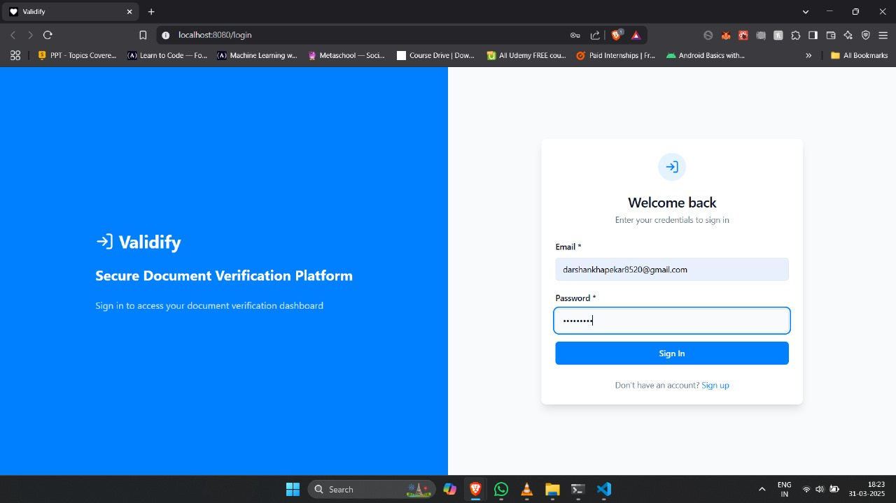
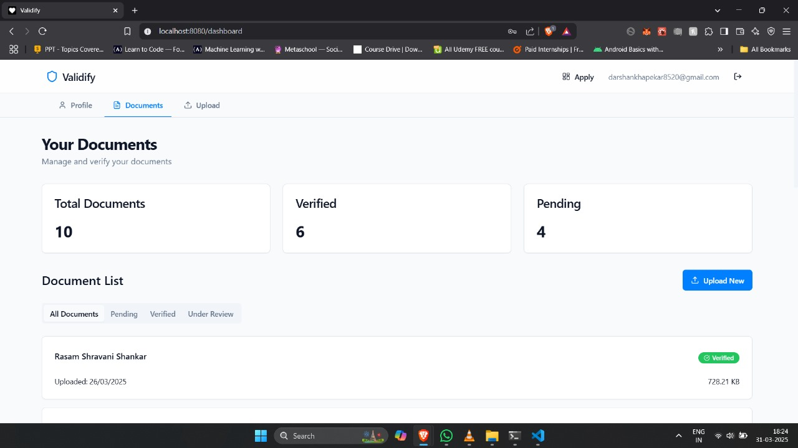
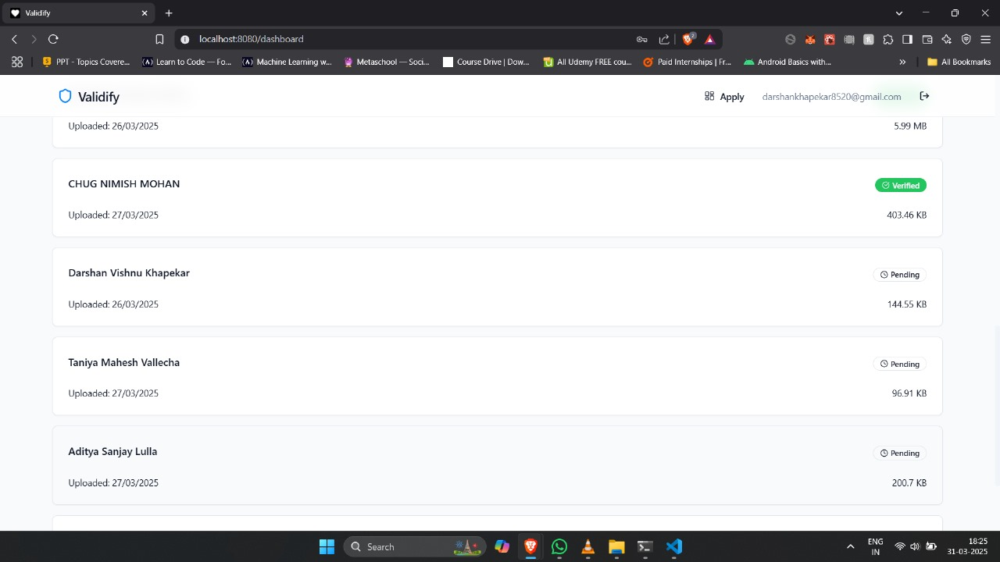
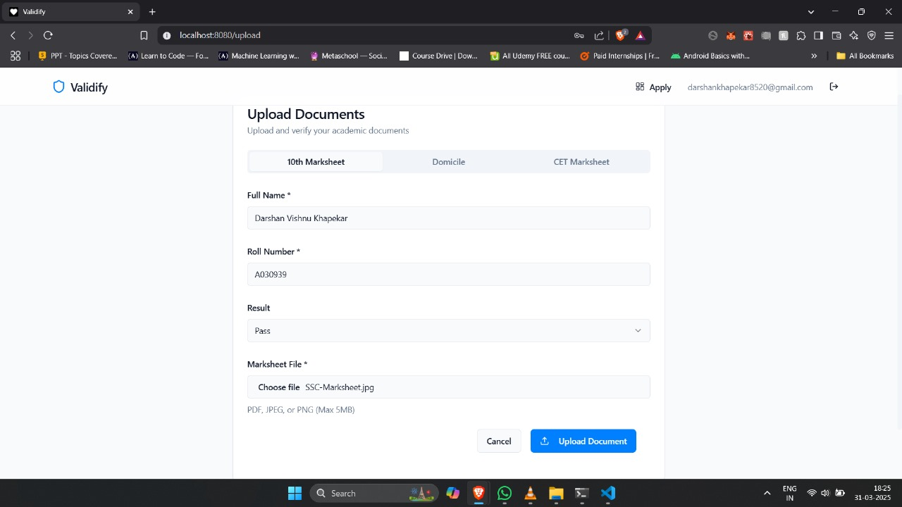

# ✅ Validify: Automated Document Validation System

**Validify** is an automated document validation system that extracts, compares, and verifies user-submitted data against uploaded documents using OCR, image processing, and machine learning. 

---

## 🚀 Features

- 🔐 Secure user and admin login system
- 📤 Upload and validate multiple document types
- 🤖 Intelligent Document Processing (IDP) using OCR and image processing
- 📊 Real-time document validation status and history
- 🛠️ Admin dashboard for manual review of rejected submissions
- 🔌 API-based design for easy external integration
- 🧾 Profile management with update capability

---

## 🧰 Tech Stack

- **Frontend:** React (TypeScript), Tailwind CSS, Axios
- **Backend:** Python (Flask or Django), REST APIs
- **Database:** Firebase (real-time database)
- **Machine Learning:** YOLOv5, TensorFlow / PyTorch, OpenCV, Tesseract OCR, NLP

---

## 🧪 How It Works

1. **User Registration & Document Upload**
   - Users create a profile and upload identity documents.

2. **Data Extraction & Validation**
   - OCR (Tesseract) extracts document text.
   - Image pre-processing via OpenCV improves accuracy.
   - NLP tools compare user-entered data with extracted content.
   - Forgery detection model (YOLO) scans for image tampering.

3. **Result Handling**
   - If data matches and document is valid → marked “Verified”.
   - If mismatched or forged → flagged for **manual admin review**.

4. **Admin Review**
   - Admin can view flagged requests and override the result with feedback.

---

## 📸 Screenshots

